<div align="center">

# ⟢ CARE COMPANION ⟣

```
╔═══════════════════════════════════════════════════════════════════╗
║   ◉  C A R E   C O M P A N I O N                                  ║
║      ระบบนำร่องมนุษย์ · HUMAN ESCORT NETWORK · v1.0               ║
║                                                                   ║
║   STATUS ▸ ONLINE               GRID ▸ 77 จังหวัด                 ║
║   CORE   ▸ SUPABASE             COPILOT ▸ GEMINI 3.5 FLASH        ║
╚═══════════════════════════════════════════════════════════════════╝
```

### ไม่มีใครควรต้องไปโรงพยาบาล ธนาคาร หรือที่ว่าการอำเภอ **คนเดียว**

เครือข่ายจับคู่ **ผู้ขอ** กับ **เพื่อนเดินทาง** ที่ไปเป็นเพื่อนจนจบธุระ แล้วกลับถึงบ้านอย่างปลอดภัย

<br/>

[](https://care-companion-nine-navy.vercel.app)
[](https://github.com/Markrock342/care-companion)


<br/>

> ⚠️ **โปรโตคอลความปลอดภัย** · นี่ **ไม่ใช่** บริการทางการแพทย์ ไม่ใช่ผู้ดูแลผู้ป่วย
> เพื่อนเดินทางไปเป็นเพื่อนและอำนวยความสะดวกเท่านั้น

</div>

---

<div align="center">

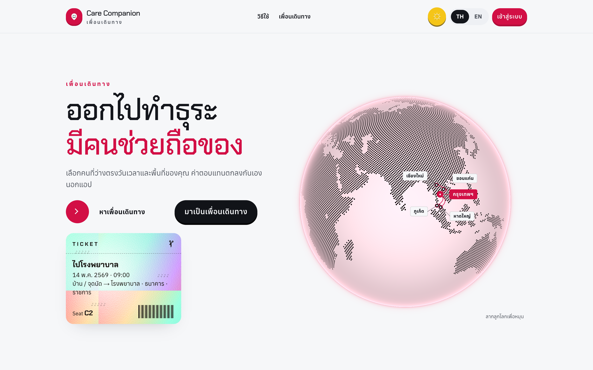

</div>

---

## ◈ เข้าระบบทันทีด้วยรหัสทดลอง

กดปุ่มเดียวในหน้าล็อกอิน ไม่ต้องพิมพ์ ไม่ต้องสมัคร — รหัสผ่านเดียวกันทุกบัญชี: **`Demo1234!`**

<div align="center">

| 🛡 บทบาท | รหัสประจำตัว | เห็นอะไร |
| :--- | :--- | :--- |
| **`ADMIN`** ผู้ควบคุมระบบ | `admin@demo.test` | แดชบอร์ด สถิติ สมาชิก คำขอ ประวัติคำสั่ง |
| **`CUSTOMER`** ผู้ขอเดินทาง | `customer@demo.test` | คำขอครบทุกสถานะ AI ช่วยกรอก ลิงก์ญาติ |
| **`COMPANION`** เพื่อนเดินทาง | `companion@demo.test` | คำเชิญ ปฏิทินรายสัปดาห์ เตือนเวลาชน |

</div>

ผู้ใช้จริงเข้าด้วย **Google Account** เท่านั้น

---

## ◈ ระบบย่อยบนยาน

<table>
<tr>
<td width="50%" valign="top">

### 🧠 AI COPILOT
ขับเคลื่อนด้วย Gemini แบบ structured JSON

- **AUTO-FILL** — พิมพ์ *"พรุ่งนี้ 9 โมงพาแม่ไปศิริราช"* แล้วฟอร์มกรอกเอง ทั้งประเภท วันเวลา สถานที่ ค่าตอบแทน และหมุดแผนที่
- **TRIP ANALYSIS** — สรุปงาน เช็กลิสต์ของที่ต้องเตรียม ประเมินค่าตอบแทนว่าต่ำ/เหมาะสม/สูง และสิ่งที่ควรตกลงกันก่อนออกเดินทาง
- ช่องที่ไม่แน่ใจจะเว้นว่าง **ไม่เดาแทนผู้ใช้**

</td>
<td width="50%" valign="top">

### 🛟 SAFETY NET
ออกแบบให้ญาติที่อยู่ไกลสบายใจ

- **FAMILY LINK** — ลิงก์ติดตามสด เปิดได้โดยไม่ต้องล็อกอิน ปิดเองเมื่อจบงาน
- **BEACON** — แชร์ตำแหน่งระหว่างเดินทาง อัปเดตอัตโนมัติทุกนาที
- **SOS** — ปุ่มโทรหาญาติ / 1669 / อีกฝ่าย ในที่เดียว
- **CLASH GUARD** — ปฏิทินรายสัปดาห์ + เตือนเมื่อรับงานเวลาชนกัน

</td>
</tr>
<tr>
<td width="50%" valign="top">

### ⚙️ CORE
หัวใจของแพลตฟอร์ม

- Google OAuth ผ่าน Supabase Auth
- จับคู่จากจังหวัด วัน เวลา และค่าตอบแทนขั้นต่ำ
- วงจรงาน: รอจับคู่ → มีเพื่อนแล้ว → เดินทาง → จบงาน
- แชทเรียลไทม์ + รีวิวสองทาง
- **Row Level Security ทุกตาราง** — สิทธิ์ตัดสินที่ฐานข้อมูล

</td>
<td width="50%" valign="top">

### 🎛 CONTROL DECK
ห้องควบคุมของแอดมิน

- KPI, กราฟ 8 สัปดาห์, ประเภทธุระ, จังหวัดยอดนิยม
- สมาชิกทั้งระบบ: ค้นหาด้วยชื่อ/อีเมล/เบอร์ ดูเวลาเข้าใช้ล่าสุด
- อนุมัติ ระงับ เปลี่ยนบทบาท ยกเลิกคำขอ
- **BLACK BOX** — บันทึกทุกคำสั่งของแอดมินย้อนหลังได้

</td>
</tr>
</table>

---

## ◈ ภาพจากห้องควบคุม

<div align="center">

### 🎛 แดชบอร์ดแอดมิน
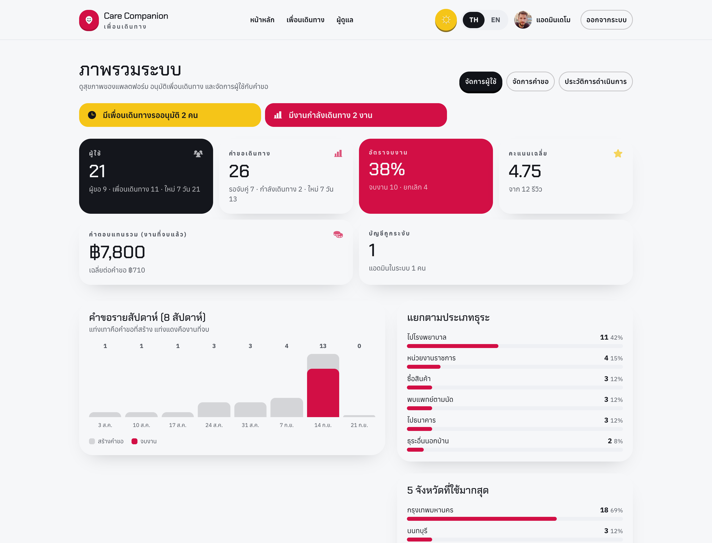

### 👥 สมาชิกทั้งระบบ
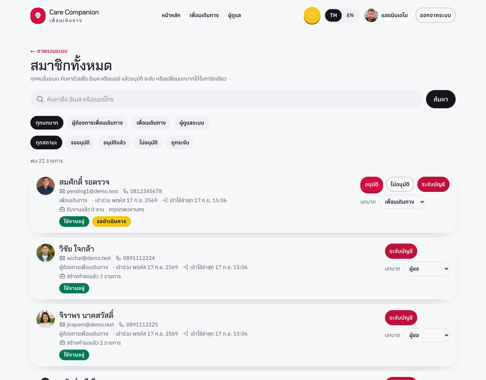

</div>

<table>
<tr>
<td width="50%" valign="top" align="center">

**🧠 AI กรอกฟอร์มจากประโยคเดียว**

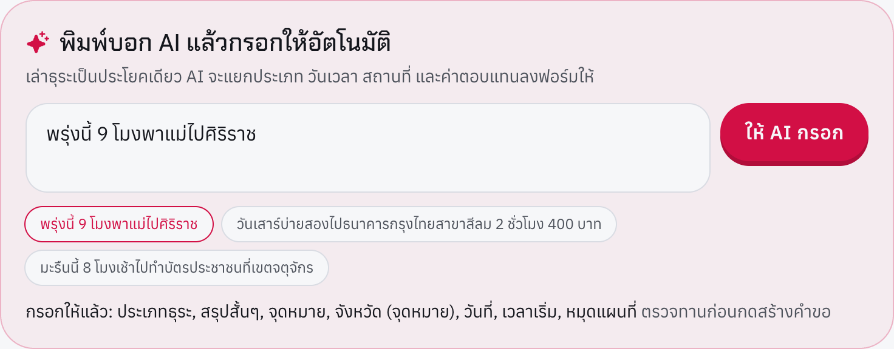

</td>
<td width="50%" valign="top" align="center">

**🔍 AI วิเคราะห์คำขอ**

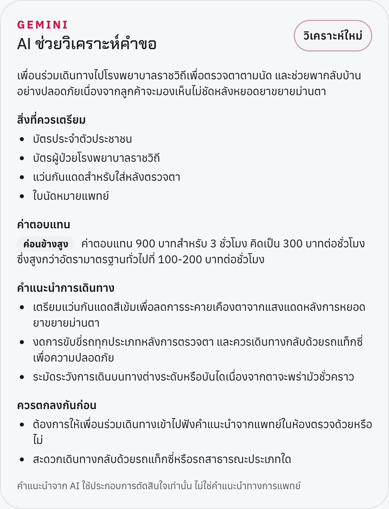

</td>
</tr>
<tr>
<td width="50%" valign="top" align="center">

**🛟 กล่องความปลอดภัยระหว่างเดินทาง**

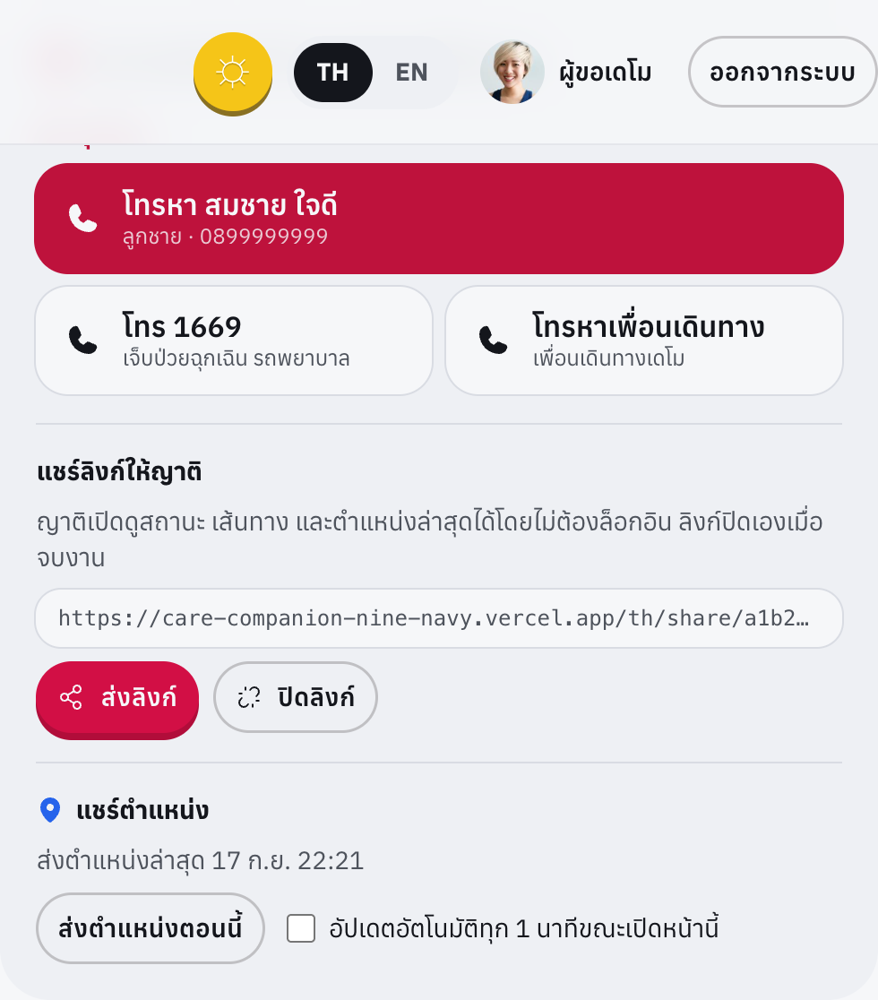

</td>
<td width="50%" valign="top" align="center">

**📅 ปฏิทินงาน + เตือนเวลาชน**

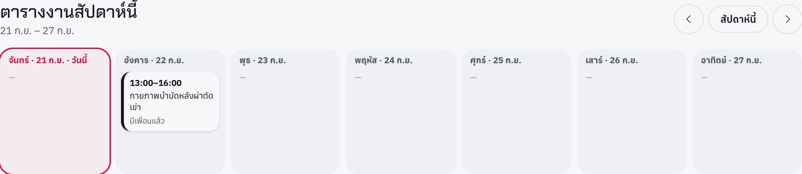

</td>
</tr>
</table>

<div align="center">

**📱 หน้าที่ญาติเห็นจากลิงก์ติดตาม (ไม่ต้องล็อกอิน)**

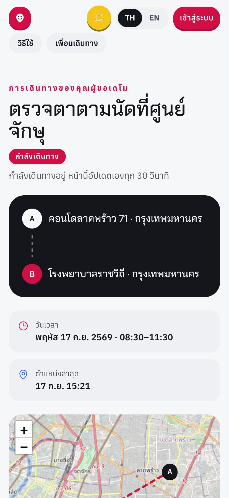

</div>

---

## ◈ ผังระบบ

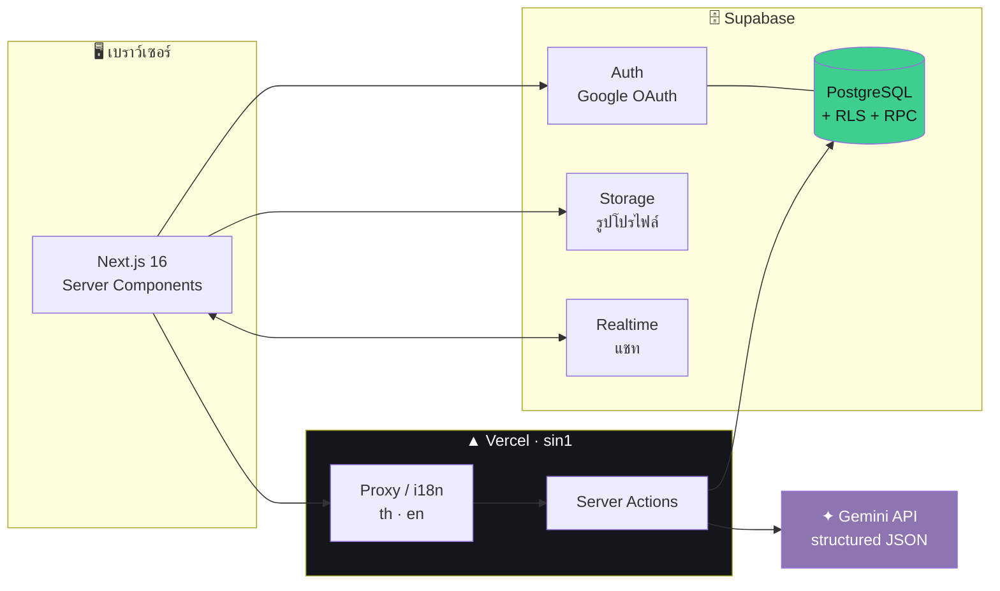

## ◈ วงจรชีวิตของหนึ่งคำขอ

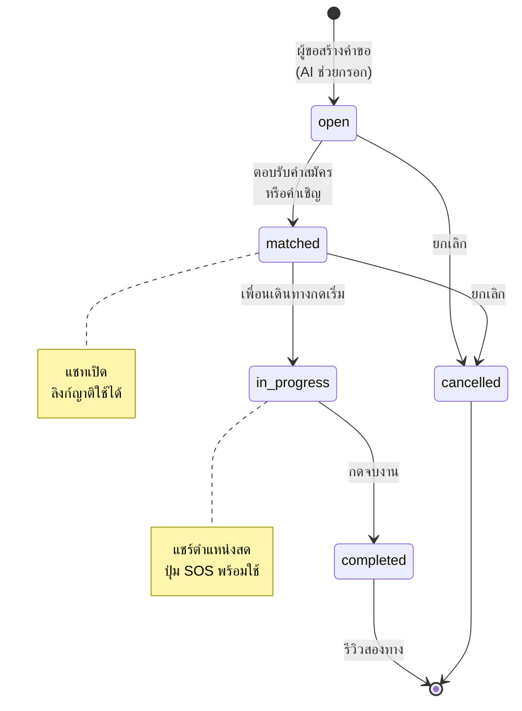

## ◈ AI ทำงานยังไง

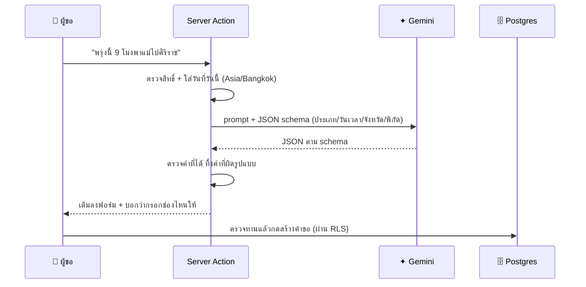

---

## ◈ ลำดับการปล่อยยาน

<details open>
<summary><b>1 · โคลนและติดตั้ง</b></summary>

```bash
git clone https://github.com/Markrock342/care-companion.git
cd care-companion
npm install
cp .env.example .env.local
```

</details>

<details>
<summary><b>2 · ฐานข้อมูล (Supabase → SQL Editor)</b></summary>

รันตามลำดับ:

| # | ไฟล์ | หน้าที่ |
| :--- | :--- | :--- |
| 1 | `supabase/schema.sql` | ตาราง · RLS · RPC · Storage bucket |
| 2 | `supabase/migrations/002_trip_safety.sql` | ลิงก์ญาติ · ตำแหน่ง · ผู้ติดต่อฉุกเฉิน |
| 3 | `supabase/migrations/003_admin_console.sql` | สถิติแอดมิน · บันทึกคำสั่ง |
| 4 | `supabase/migrations/004_admin_members.sql` | รายชื่อสมาชิกพร้อมอีเมล |
| 5 | `supabase/seed-demo.sql` | บัญชีและข้อมูลตัวอย่าง *(ไม่บังคับ)* |

รูปโปรไฟล์ตัวอย่าง:

```bash
node --env-file=.env.local scripts/seed-demo-avatars.mjs
```

</details>

<details>
<summary><b>3 · กุญแจ (.env.local)</b></summary>

```bash
NEXT_PUBLIC_SUPABASE_URL=https://<project>.supabase.co
NEXT_PUBLIC_SUPABASE_ANON_KEY=<publishable key>
GEMINI_API_KEY=<key จาก aistudio.google.com/apikey>
NEXT_PUBLIC_GOOGLE_MAPS_API_KEY=            # ไม่ใส่ก็ได้ จะใช้ OpenStreetMap แทน
```

</details>

<details>
<summary><b>4 · เปิด Google OAuth</b></summary>

1. [Google Cloud Console](https://console.cloud.google.com/apis/credentials) → สร้าง OAuth Client (Web)
   redirect URI: `https://<project>.supabase.co/auth/v1/callback`
2. Supabase → **Authentication → Providers → Google** ใส่ Client ID / Secret
3. Supabase → **URL Configuration** เพิ่ม `<โดเมน>/th/auth/callback` และ `/en/auth/callback`

</details>

<details>
<summary><b>5 · จุดเครื่อง</b></summary>

```bash
npm run dev        # http://localhost:3000 → /th
npm run build      # ตรวจก่อนขึ้นจริง
npm run dev:clean  # ล้าง cache แล้วเริ่มใหม่
```

</details>

---

## ◈ ผังห้องเครื่อง

```
care-companion/
├─ app/[locale]/          หน้าเว็บทุกภาษา
│  ├─ admin/              แดชบอร์ด · สมาชิก · คำขอ · ประวัติคำสั่ง
│  ├─ customer/           คำขอของฉัน
│  ├─ companion/          งาน + ปฏิทินรายสัปดาห์
│  ├─ trips/              สร้างคำขอ · รายละเอียด · แชท
│  └─ share/[token]/      หน้าติดตามสำหรับญาติ (ไม่ต้องล็อกอิน)
├─ components/            landing · trips · admin · map · account · ui
├─ lib/
│  ├─ actions/            server actions: trips · profile · admin · ai · safety
│  ├─ ai/gemini.ts        เรียก Gemini แบบ JSON schema
│  ├─ matching.ts         คะแนนจับคู่เพื่อนเดินทาง
│  └─ schedule.ts         ตรวจเวลาชน + สัปดาห์ปฏิทิน
├─ messages/              คำแปล th · en
├─ supabase/              schema.sql · migrations/ · seed-demo.sql
└─ docs/                  สคริปต์เดโม + ภาพหน้าจอ
```

---

## ◈ กฎของเครือข่าย

| ◇ | กติกา |
| :--- | :--- |
| 💸 | ค่าตอบแทนตกลงกันเอง **จ่ายนอกระบบ** ไม่มี payment gateway |
| ✅ | เพื่อนเดินทางต้องผ่านการอนุมัติจากแอดมินก่อนรับงาน |
| 💬 | แชทเปิดหลังจับคู่ · รีวิวได้หลังจบงานเท่านั้น |
| ☎️ | เบอร์ผู้ติดต่อฉุกเฉินเห็นเฉพาะคู่เดินทางของงานที่ยังไม่จบ |
| 🔗 | ลิงก์ญาติหมดอายุเองเมื่อจบงาน และผู้ขอปิดได้ตลอดเวลา |
| 🔐 | ทุกคำสั่งของแอดมินผ่านฟังก์ชันที่เช็กสิทธิ์ซ้ำในฐานข้อมูล และถูกบันทึกไว้ |

---

<div align="center">

### เดินทางด้วยกัน ไม่ต้องไปคนเดียว

`END OF TRANSMISSION ▸ ◉`

</div>
